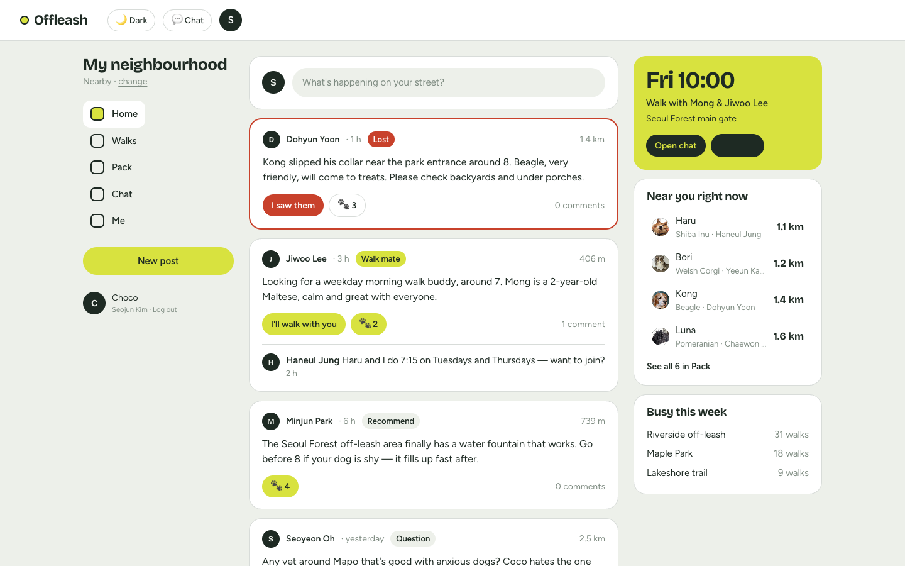
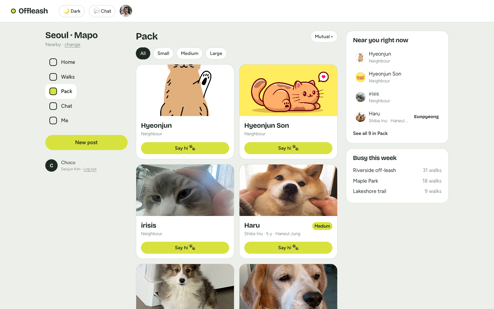
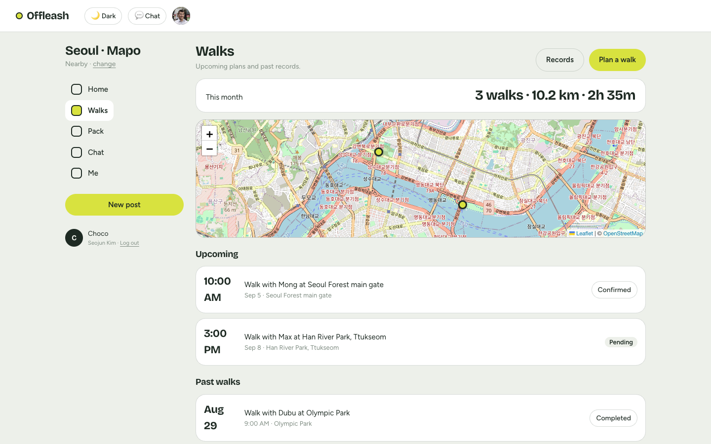
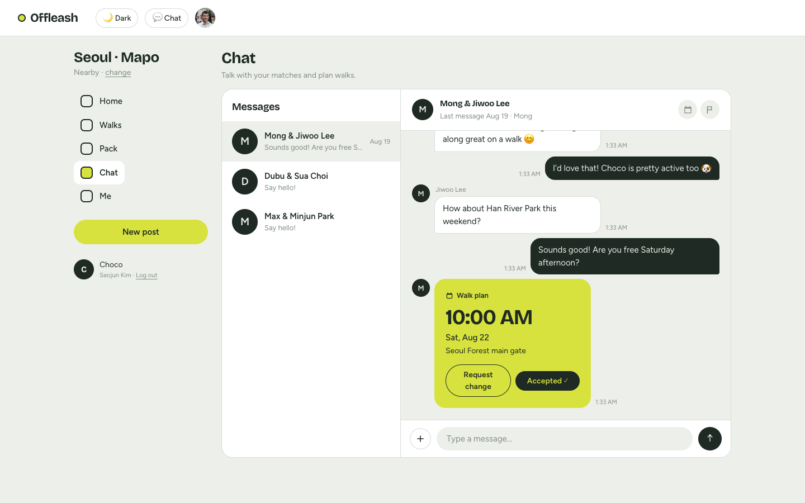
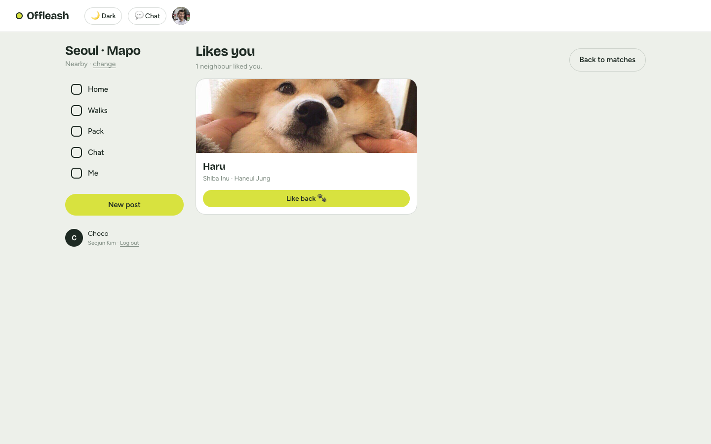

# Offleash — your neighbourhood, off the leash 🎾

[](https://github.com/HyeonjunSon/petApp-frontend/actions/workflows/ci.yml)

A neighbourhood community for dog owners: a local feed, walk plans on a map, and the dogs
around you sorted by real distance. This repo is the **web frontend**; the API lives in
[`petApp-server`](https://github.com/HyeonjunSon/petApp-server).

**Live demo:** https://pet-app-frontend-fawn.vercel.app
**Demo login:** `demo1@petdate.app` / `Petdate123!` — seeded with matches, chats, walk plans and a busy feed.



## What it does

| | |
|---|---|
| **Neighbourhood feed** | Lost-dog alerts, walk-mate calls, recommendations and questions from people nearby — with paw reactions and replies. Post distance comes from real coordinates. |
| **Pack** | The dogs around you, sorted by real distance (`$geoNear` + 2dsphere). Say hi → mutual like becomes a match. |
| **Walks** | Plan a walk with a matched neighbour: pick the meeting point on a map (Leaflet + OSM), accept/decline, and completed walks turn into records automatically. |
| **Chat** | Real-time Socket.IO messaging with read receipts and walk-invite cards you can accept inline. |
| **Premium** | Subscription lifecycle (demo checkout → entitlements → cancel with benefits until period end) gating the "Likes you" screen. |

<p>
  
  
</p>
<p>
  
  
</p>

## Stack

**Next.js 14 (App Router) · TypeScript · Redux Toolkit + RTK Query · Tailwind CSS v4 · Leaflet · Socket.IO client · zustand**

### Architecture notes (the interesting parts)

- **RTK Query owns the data layer** — one api slice (`src/store/api.ts`) with tag-based cache
  invalidation (`like → Matches/LikesMe`, `invite accept → Invites/Walks`, `checkout → Billing`)
  and optimistic updates via `onQueryStarted`: paw reactions toggle instantly with rollback,
  new posts unshift into the cache, liked dogs leave the deck before the server responds.
  Screens sharing a query (walks list, records, home rail, sidebar) share one cache entry.
- **Deliberate boundaries** — the Socket.IO chat stream, the auth session (zustand) and
  multipart photo uploads stay on a thin axios client instead of being forced into RTK Query.
- **Token-driven design system** — the whole UI derives from CSS custom properties in
  `globals.css` (ink/paper surfaces, one tennis-ball accent, bordered cards); dark mode is a
  token flip, and an alias layer let two full redesigns ship without touching feature code.
- **Maps without keys** — Leaflet + OpenStreetMap (no API token), SSR-excluded via
  `next/dynamic`; the meeting-point picker writes GeoJSON the API stores on the walk invite.

## Getting started

```bash
npm install
npm run dev        # http://localhost:3000 — expects the API on :5050
npm run build      # production build (28 routes)
npm run typecheck
```

Environment (optional — defaults to a local API):

```bash
NEXT_PUBLIC_API_BASE_URL=https://your-api.example.com/api
```

Run the API locally from [`petApp-server`](https://github.com/HyeonjunSon/petApp-server)
(`npm run dev`, seeded with `node scripts/seed-demo.js`).

## Structure

```
src/
  app/
    (auth)/login, register     # email-code signup, password reset
    (protected)/               # app shell: SiteHeader + sidebar/main/rail grid
      home/                    # neighbourhood feed + next-walk rail
      pack/                    # dogs nearby, distance-sorted
      walks/  walks/new        # plans + map picker, records
      chat/                    # Socket.IO chat (useChat hook)
      matches/ likes/          # mutuals + premium-gated likes
      me/ settings/ subscription/ onboarding/
  components/                  # feed cards, WalkMap (Leaflet), shell, ui kit
  store/                       # RTK Query api slice + store, zustand auth
  lib/                         # axios client, card adapter, theme
```

Deployed on **Vercel**; the API runs on Heroku with MongoDB Atlas + Neon Postgres
(analytics) — see the [server README](https://github.com/HyeonjunSon/petApp-server#readme).
